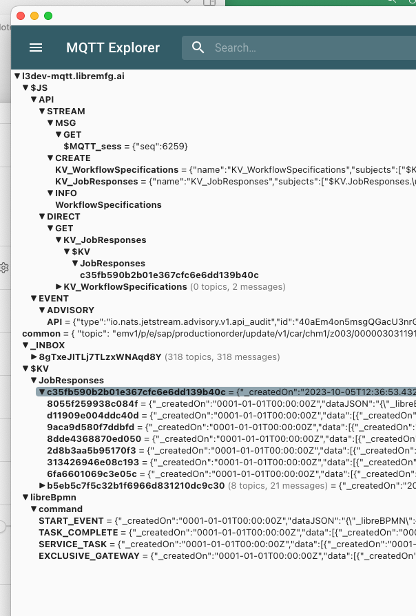

Rhize uses the [NATS message broker](https://nats.io/) for its publish-subscribe messaging.
Through NATS, Rhize can decouple services, exchange messages in real-time,
and receive event data from all levels of the operation.

These sections describe NATS parameters that are particularly relevant to Rhize's configuration.
For general use, refer to the [NATS official documentation](https://docs.nats.io/nats-concepts/overview).

## Built-in topics

Generally, operators have complete control over what events a service publishes or subscribes to.
However, a few critical topics are built-in to some services.

## Root topics
- $JS
  - Purpose:  Jet Stream

- $KV
  - Purpose:  Key-Value store

- _INBOX
  - Purpose:  Temporary inbox for request-response messaging????

- libreBPMN
  - Purpose:  BPMN engine

## Subtopics

- $KV/JobResponses
  - Purpose: 
  - Expected structure:
  - Publishers: serviceOne, serviceTwo
  - Subcribers: serviceX, serviceY

- libreBPMN/command/START_EVENT
  - Purpose: 
  - Expected structure:
  - Publishers: serviceOne, serviceTwo
  - Subcribers: serviceX, serviceY

- libreBPMN/command/TASK_COMPLETE
  - Purpose: 
  - Expected structure:
  - Publishers: serviceOne, serviceTwo
  - Subcribers: serviceX, serviceY

- libreBPMN/command/SERVICE_TASK
  - Purpose: 
  - Expected structure:
  - Publishers: serviceOne, serviceTwo
  - Subcribers: serviceX, serviceY

- libreBPMN/command/EXCLUSIVE_GATEWAY (or just GATEWAY?)
  - Purpose: 
  - Expected structure:
  - Publishers: serviceOne, serviceTwo
  - Subcribers: serviceX, serviceY

_Editor's note:
Maybe it makes more sense to make list by service, rather than by topic._

## Message queue parameters

You can configure message queues in two ways:
- By size (for example `2GB`)
- By TTL limits (for example, `7 days`)

_Editor's note: Make a list or table of parameters.
Whatever would help people look up values while they implement._

